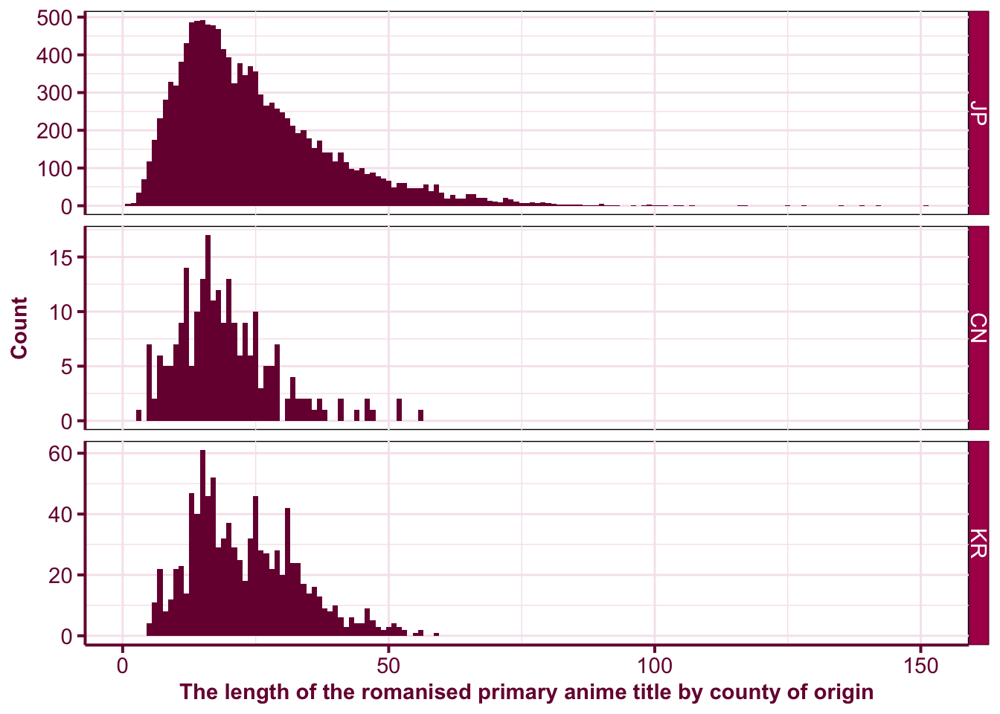
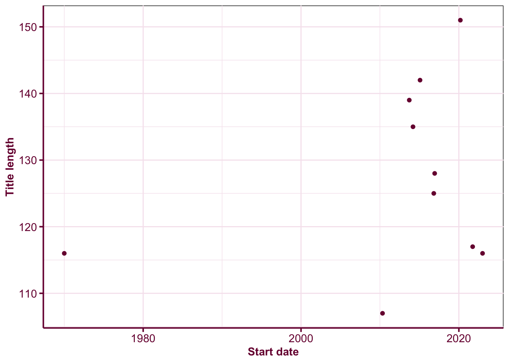

::: {.cell layout-align="center" hash='cache/unnamed-chunk-1_4724481b55bd02f5a7ee4c50ea073b08'}
<div class='toggle-code'><style type="text/css">
.toggle-code {
  display: none;
}

button {
  border-radius: 10px;
  color: var(--aside-color, rgba(0, 0, 0, 0.6));
  border-color: var(--aside-color, rgba(0, 0, 0, 0.6));
}

.scroll-output {
  height: 200px;
  overflow-y: scroll!important;
}
</style>
</div>
:::


<aside>
<p><button onclick="showscript()">Click Me</button> to see all code in this article. You can also find the link to the source Rmd file at the footer.</p>
  
</aside>


::: {.cell layout-align="center"}
<div class='toggle-code'>

```{.r .cell-code}
library(tidyverse)
```

::: {.cell-output .cell-output-stderr}
```
── Attaching packages ─────────────────────────────────────── tidyverse 1.3.1 ──
```
:::

::: {.cell-output .cell-output-stderr}
```
✔ ggplot2 3.3.6     ✔ purrr   0.3.4
✔ tibble  3.1.8     ✔ dplyr   1.0.9
✔ tidyr   1.2.0     ✔ stringr 1.4.0
✔ readr   2.1.2     ✔ forcats 0.5.1
```
:::

::: {.cell-output .cell-output-stderr}
```
── Conflicts ────────────────────────────────────────── tidyverse_conflicts() ──
✖ dplyr::filter() masks stats::filter()
✖ dplyr::lag()    masks stats::lag()
```
:::

```{.r .cell-code}
library(scales)
```

::: {.cell-output .cell-output-stderr}
```

Attaching package: 'scales'
```
:::

::: {.cell-output .cell-output-stderr}
```
The following object is masked from 'package:purrr':

    discard
```
:::

::: {.cell-output .cell-output-stderr}
```
The following object is masked from 'package:readr':

    col_factor
```
:::

```{.r .cell-code}
library(anidb)
theme_set(
  theme(panel.background = element_rect(fill = NA),
        panel.grid = element_line(color = "#f6e5ee"),
        axis.text = element_text(color = "#79003e"),
        axis.line = element_line(color = "#79003e", size = 0.7),
        axis.ticks.length = unit(1.4, "mm"),
        axis.ticks = element_line(color = "#79003e", size = 0.7),
        axis.title = element_text(color = "#79003e", face = "bold"),
        strip.background = element_rect(color = "#79003e",
                                        fill = "#AD0059"),
        strip.text = element_text(color = "white"),
        plot.title.position = "plot",
        plot.title = element_text(color = "#79003e", face = "bold")))
```

</div>
:::

::: {.cell layout-align="center" hash='cache/data_7e0e49aa50caf9bc484d87a92ee3fada'}
<div class='toggle-code'>

```{.r .cell-code}
db <- officialtitles %>% 
  mutate(ntitle = nchar(title_primary))

anime_origin <- db %>% 
  count(origin) %>% 
  deframe()

dbl <- db %>% 
  arrange(desc(ntitle)) %>% 
  slice(1:10)
```

</div>
:::


[AniDB](https://anidb.net/) is a website that hosts extensive information on anime from China, Japan and Korea. There are currently information on **13,951 anime** of which 91% originated from Japan.

As an anime lover, I've watched over 700 anime (which is still less than 5% in the whole database!) but one thing I noticed over recent years is that some anime titles are bizzarely long... or more like anime titles are becoming sentences. To explore this, I decided to use the  [`anidb`](https://github.com/emitanaka/anidb) R-package to look at the data.

First note that anime titles come in many forms.  For example, 

* "新世紀エヴァンゲリオン" is the **Japanese title**,
* "Shinseiki Evangelion" is the **primary title** (the official title in the country of origin but in romanized form), and 
* "Neon Genesis Evangelion" is the **English title**. The English title may be unavailable if the anime is not licensed for English audiences. 

In the following explorations, I use the primary title. 

Figure \@ref(fig:title-length-distribution) shows that the distribution of the primary title length. We can see that most anime titles are less than 70 characters but there are some Japanese anime title that are double this length. The top 25 animes have title length greater than 107 characters. 


::: {.cell layout-align="center" hash='cache/title-length-distribution_8ec286bd82ce90c3367c863d8e6ce91f'}
<div class='toggle-code'>

```{.r .cell-code}
ggplot(db, aes(ntitle)) +
  geom_histogram(binwidth = 1, fill = "#79003e") +
  labs(x = "The length of the romanised primary anime title by county of origin", 
       y = "Count") + 
  facet_grid(origin ~ ., scales = "free_y")
```

</div>
:::

::: {.cell layout-align="center" hash='cache/title-length-distribution_05daed4b83076b79c11583bf2123f489'}
::: {.cell-output-display}
{fig-align='center' width=672}
:::
:::


The five longest titles from longest to shortest are: 

* "Honzuki no Gekokujou: Shisho ni Naru Tame ni wa Shudan o Erande Iraremasen - Eustachius no Shitamachi Sennyuu Daisakusen / Corinna-sama no Otaku Houmon"
* "Buta no Gotoki Sanzoku ni Torawarete Shojo o Ubawareru Kyonyuu Himekishi & Onna Senshi: Zettai Chinpo Nanka ni Maketari Shinai!! The Animation"
* "Yahari Ore no Seishun LoveCome wa Machigatte Iru. Kochira to Shite mo Karera Kanojora no Yukusue ni Sachi Ookaran Koto o Negawazaru o Enai."
* "Yuusha ni Narenakatta Ore wa Shibushibu Shuushoku o Ketsui Shimashita.: Yuusha ni Narenakatta Ore no Imouto ga Joukyou Shite Kimashita."
* "Dungeon ni Deai o Motomeru no wa Machigatte Iru Darouka: Familia Myth - Dungeon ni Onsen o Motomeru no wa Machigatte Iru Darouka"


::: {.cell layout-align="center" hash='cache/info_208fccec6399a792f2fe0066036f3f1c'}
<div class='toggle-code'>

```{.r .cell-code}
info <- anime_info(as.character(dbl$aid)) %>% 
  left_join(dbl, by = "aid")
```

</div>
:::


Because of AniDB's limit on API call (multiple requests can get you banned easily -- turns out that the limit is quite small; about 13-14 calls already got me banned...), I'm going to just study the top 25 anime in terms of title length. 

Figure \@ref(fig:release-date) suggest that super long titles are more common in the last decade than in the past. But the analysis is only based on top 25 anime with the longest titles so it could benefit from more extensive study.


::: {.cell layout-align="center" hash='cache/release-date_ec1c1c11caaccf51de4175b7c1c36606'}
<div class='toggle-code'>

```{.r .cell-code}
ggplot(info, aes(start_date, ntitle)) + 
  geom_point(color = "#79003e") + 
  labs(x = "Start date", y = "Title length")
```

</div>
:::

::: {.cell layout-align="center" hash='cache/release-date_6ad9bca34ad1dd2948914c509a0eeffb'}
::: {.cell-output-display}
{fig-align='center' width=672}
:::
:::

::: {.cell layout-align="center" hash='cache/unnamed-chunk-2_50c2eb9e1d0c0e5ab717f044228eb42c'}
<div class='toggle-code'><script type="text/javascript">
function showscript() {
  var x = document.getElementsByClassName('toggle-code');
  var n = x.length;
  for (var i = 0; i < n; i++) {
    var e = x[i];
    if (e.style.display == "block") {
      e.style.display = "none";
    } else {
      e.style.display = "block";
    }
  }
}
</script>
</div>
:::

